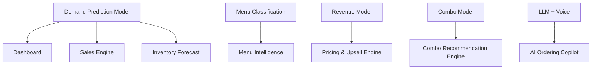

<div align="center">
  <h1>🚀 PetPooja AI — Revenue Intelligence & Voice Copilot</h1>
  <p><strong>An AI-powered decision intelligence platform that transforms restaurant PoS data into real-time revenue optimization, demand forecasting, and automated voice ordering.</strong></p>
</div>

 

---


## 🧠 Overview

Restaurants generate massive transactional data daily, yet most of it remains **underutilized**. **PetPooja AI** bridges this gap by combining **Data Analytics, Machine Learning, LLM Intelligence, and Voice Automation** into a single intelligent system. It acts as a **Revenue Copilot** that helps restaurants increase revenue, reduce inefficiencies, and automate operations.

### ❗ Problem Statement
* **80%** of restaurants fail to leverage PoS data effectively.
* **~35%** revenue loss due to missed upselling.
* Manual phone-based orders lead to errors, delays, and missed opportunities.
* **Restaurants operate on data, but without intelligence.**

---

## ✨ Features & Core Modules

📊 **Executive Dashboard** — Revenue KPIs, sales trends (historical + predicted), hourly demand heatmaps, and category-level insights.

🍽 **Menu Intelligence Engine** — STAR / DOG / PUZZLE / PLOWHORSE classification, contribution margin analysis, profitability vs popularity visualization.

📈 **Demand & Sales Engine** — Hourly demand prediction, weekly forecasting, peak-day detection, sales velocity ranking.

🧺 **Combo Recommendation Engine** — Dynamic combo detection using association rules, AOV uplift simulation, bundle pricing suggestions.

💰 **Revenue Optimization Engine** — Price optimization recommendations, upsell candidate identification, profit impact simulation.

📦 **Inventory Intelligence** — Stock-out prediction, reorder recommendations, demand-linked inventory planning.

🗣 **AI Voice Ordering Copilot** — Multi-language voice ordering (English, Hindi, Hinglish), STT → intent extraction → structured order, real-time upsell suggestions, direct PoS integration (KOT generation).

🧠 **Business AI Chat** — Context-aware responses using database queries. Discuss menu insights, inventory risks, and pricing suggestions.

---

## 🏗 System Architecture

The platform is designed with a hierarchical data flow where the Demand Prediction ripples through the rest of the application ecosystem.



---

## 🧠 Machine Learning Architecture (CORE HIGHLIGHT)

The system is powered by **4 focused ML models** — designed for real-world impact, not overengineering.

### 🔹 1. Demand Prediction Model (The Core Engine)
**Goal:** Forecast future demand.
* **Inputs:** `date, hour, item_id, category, past_sales`
* **Output:** `predicted_quantity`
* **Model:** Random Forest / XGBoost
* **Drives:** Dashboard predictions, Sales forecasting, Inventory planning
> 💡 *“Tomorrow expected orders: 52 (+18%)”*

### 🔹 2. Menu Classification Model
**Goal:** Identify item performance.
* **Logic:** STAR (High sales/high margin), PLOWHORSE (High sales/low margin), PUZZLE (Low sales/high margin), DOG (Low sales/low margin)
* **Approach:** Rule-based (fast & interpretable), extendable to ML classification.
> 💡 *“Paneer Biryani likely to drop to PLOWHORSE”*

### 🔹 3. Revenue Optimization Model
**Goal:** Simulate revenue outcomes.
* **Inputs:** `price, demand, discount`
* **Output:** `projected_revenue`
* **Model:** Regression
* **Enables:** Pricing experiments and profit optimization.
> 💡 *“Increase price by ₹20 → +₹12K monthly profit”*

### 🔹 4. Combo Recommendation Model
**Goal:** Identify item pairings to drive AOV.
* **Model:** Apriori (Association Rule Mining)
* **Enables:** Dynamic combos and upsell recommendations.
> 💡 *“Pizza + Cold Coffee is a high-performing combo”*

### 🔥 Bonus: Inventory Forecasting
Built on the Demand Model, predicts stock exhaustion timelines.
> 💡 *“Cheese will run out in 1.8 days”*

---

## 🛠 Tech Stack

| Layer | Technology |
|-------|------------|
| **Frontend** | Next.js 14 (App Router), TailwindCSS |
| **Backend** | Supabase (PostgreSQL + APIs), Next.js Server Actions |
| **Machine Learning** | Scikit-learn, XGBoost, Apriori Algorithm |
| **AI / Voice** | LLM APIs (OpenAI / OpenRouter), Speech-to-Text, Text-to-Speech |
---

## 🚀 Quick Start

### 1. Clone & Install
```bash
git clone https://github.com/aryanjadav3125/petpooja-ai.git
cd petpooja-ai
npm install
```


### 2. Configure Environment
```bash
cp .env.example .env.local
```
Edit `.env.local` with your credentials:
```env
NEXT_PUBLIC_SUPABASE_URL=your_supabase_url
NEXT_PUBLIC_SUPABASE_ANON_KEY=your_supabase_anon_key
SUPABASE_SERVICE_ROLE_KEY=your_service_role_key
LLM_PROVIDER=openrouter # or openai
OPENROUTER_API_KEY=your_api_key
```

### 3. Run Locally
```bash
npm run dev
# Open http://localhost:3000
```

---

## 🗄 Database Design

**Tables:** `Merchant`, `Menu`, `Orders`, `Order_Items`, `Inventory`, `Recommendations`, `Kitchen_Orders`

**Analytical Views:** `item_sales_analysis`, `menu_performance_classification`, `combo_detection`, `upsell_candidates`, `price_optimization_candidates`, `inventory_alerts`

---

## 💼 Recruiter Context

### 🎤 Interview Pitch
> “I built an AI-powered restaurant intelligence system that leverages machine learning models like Random Forest, Regression, and Apriori to predict demand, optimize pricing, and generate combo recommendations. It also includes a voice-based ordering assistant that automates phone orders and performs real-time upselling. The goal was to convert raw PoS data into actionable business decisions.”

### 📝 Resume Bullet
* Developed an **AI-powered restaurant analytics & voice automation platform** using Next.js, Supabase, and ML models (Random Forest, Regression, Apriori), enabling demand forecasting, revenue optimization, and real-time upselling.

---

## 👨‍💻 Team & Contributors

* **Aryan Jadav**
* **Nilaksh Pathak**
* **Darshit Kamdar**
* **Deval Sindha**

---

> *"This project is not just a dashboard. It is a **decision intelligence system** designed to increase revenue, automate operations, and enable data-driven restaurants."*
